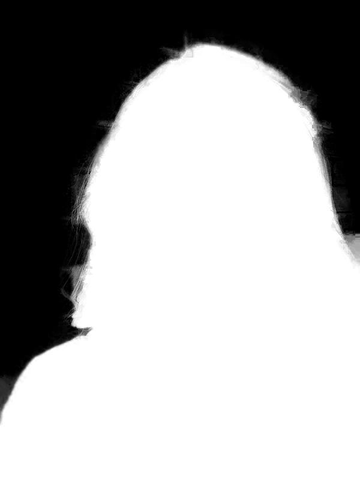
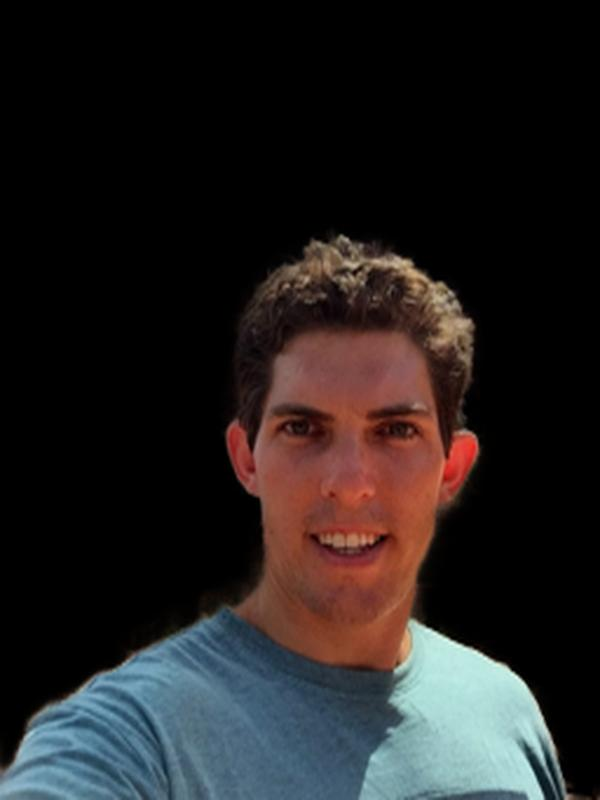

# Selfie-segmentation

## Overview

This repository contains the code and data for selfie image segmentation project. The project aims to automatically segment a person's face and body from a selfie image, by using deep learning models and computer vision techniques.

 

## Requirements

- Python 3.7+
- TensorFlow
- Pillow
- NumPy
- Matplotlib

  

## Dataset 

#### This dataset is split into 1700 training samples and 300 testing samples, stored in "training" and "testing" folders respectively. Each image has a unique identifier (not unique across testing and training, though) and can be used to easily retrieve its corresponding matte/segmentation. The segmentation are only binary -- foreground and background.

- **[Dataset](https://www.kaggle.com/datasets/tommzzhou/human-img-seg)**

Example from data set

    
    

## Model

The model used for selfie image segmentation is a U-Net architecture, which consists of an encoder and a decoder network. The encoder network extracts features from the input image, while the decoder network generates the segmentation mask based on the extracted features.

The model is trained using binary-crossEntorpy as loss function, Dice coefficient and IoU as evaluation metric, and optimized using the Adam optimizer. The model is trained for 100 epochs, with a batch size of 32.

**[Download model](https://drive.google.com/uc?id=1-JgAGLlqEjmRxwYqqJFKx5o59FiOWyhX)**

 

## Results

The trained model achieves an Dice coefficient of 0.9629 on the test set,The segmentation results are visually appealing, with accurate and consistent delineation of the person's face and body.

**Example for model result**

    
    

 

## Conclusion

In conclusion, this project demonstrates an effective approach to selfie image segmentation using a U-Net model and a well-curated dataset. The results show that the model is capable of accurately segmenting a person's face and body from a selfie image, with potential applications in various domains such as social media, e-commerce, and entertainment.

 

**[Colab Notebook](https://colab.research.google.com/drive/1_ScnyyP6axYOLAQHmbW4egAAVN-Dt7Vr?usp=sharing)**

**[Live demo](https://yousef-nasr-selfie-background-remover.streamlit.app/)**
